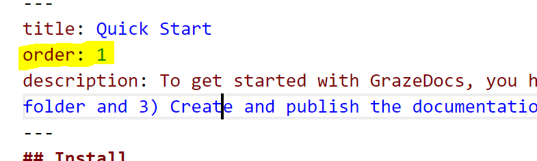

## Ordering pages

By default the pages are ordered by their filenames. If you want to manually order pages, you can use "order" metadata:



Ordering allows you to make sure that for example the "Getting started" documentation can be found from the top.

## Ordering Groups

Each page is part of a group. Group details are defined in the configuration.xml:

```xml
    <Groups>
      <Group Key="">Home</Group>
      <Group Key="architecture">My Architecture</Group>
      <Group Key="about">About</Group>
    </Groups>
```

In the above example, the Home group is the first, architecture is the second and so on.