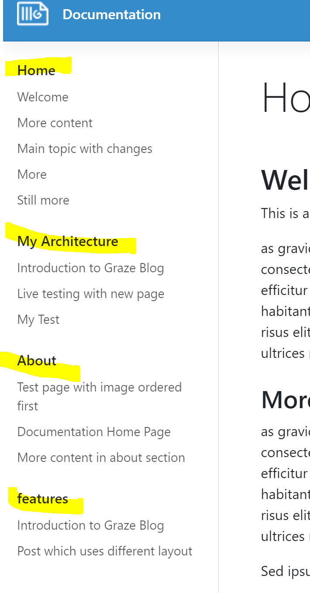
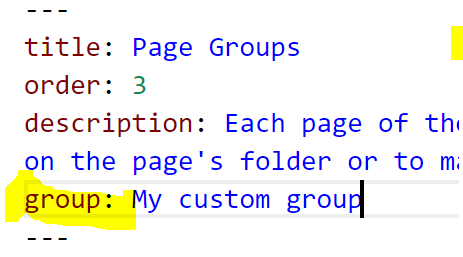

## What is a Page Group?

Each page of the documentation is part of a group:



In the example above, the documentation has four groups:

* Home
* My Architecture
* About
* features

One group can have 1-n amount of pages.

## Automatic Groups

By default GrazeDocs automatically assigns a group for each page based on the directory of the page. For example if page is in features-directory, the page's group is "features".

## Manual Groups

You can manually assign a group for each page using the "group" metadata:



## Customizing Groups

You can define names and orders for the groups using configuration.xml:

```xml
    <Groups>
      <Group Key="">Home</Group>
      <Group Key="architecture">My Architecture</Group>
      <Group Key="about">About</Group>
    </Groups>
```

Key is the directory name so for the root documentation directory the key is empty.