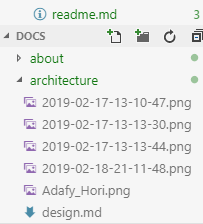
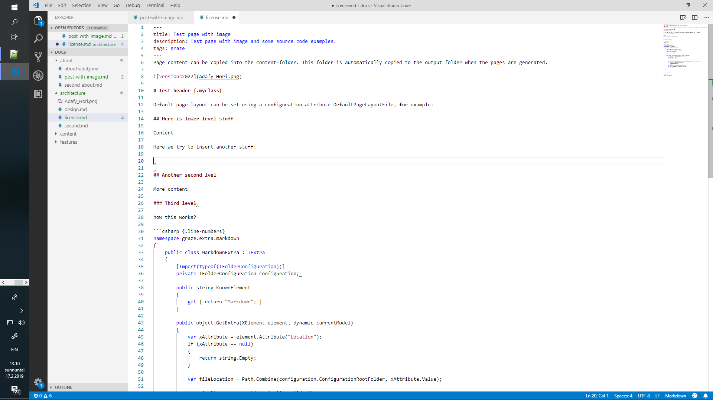
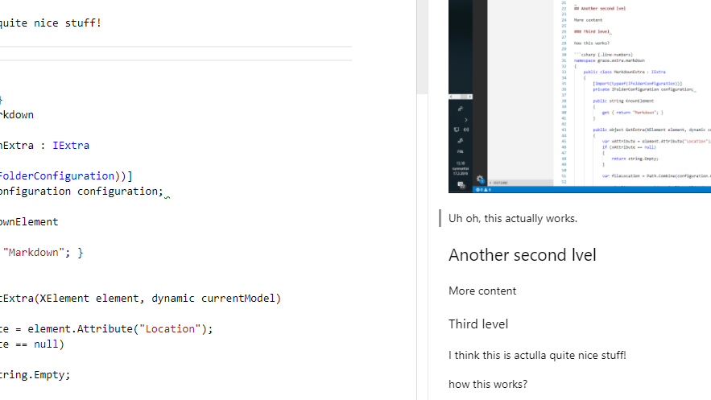

Page content can be copied into the content-folder. This folder is automatically copied to the output folder when the pages are generated.

Seems to work now with code.

here's some text.

more text

ault page layout can be set using a configuratio


# Test header {.myclass}

Default page layout can be set using a configuration attribute DefaultPageLayoutFile, for example:

## Here is lower level stuff

Content is updated live!



Here we try to insert another stuff:



oh, this actually works.

## Another second lvel

More content

### Third level 

I think this is actulla quite nice stuff!



how this works?


```csharp {.line-numbers}
namespace graze.extra.markdown
{
    public class MarkdownExtra : IExtra
    {
        [Import(typeof(IFolderConfiguration))]
        private IFolderConfiguration configuration; 

        public string KnownElement
        {
            get { return "Markdown"; }
        }

        public object GetExtra(XElement element, dynamic currentModel)
        {
            var xAttribute = element.Attribute("Location");
            if (xAttribute == null)
            {
                return string.Empty;
            }

            var fileLocation = Path.Combine(configuration.ConfigurationRootFolder, xAttribute.Value);

            var pipeline = new MarkdownPipelineBuilder()
                .UseAdvancedExtensions()
                .Build();

            var mdContent = File.ReadAllText(fileLocation);
            var result = Markdown.ToHtml(mdContent, pipeline);

            return result;
        }
    }
}

```

Another code test

```sql
SELECT * FROM Customers
WHERE CustomerID=1;
```