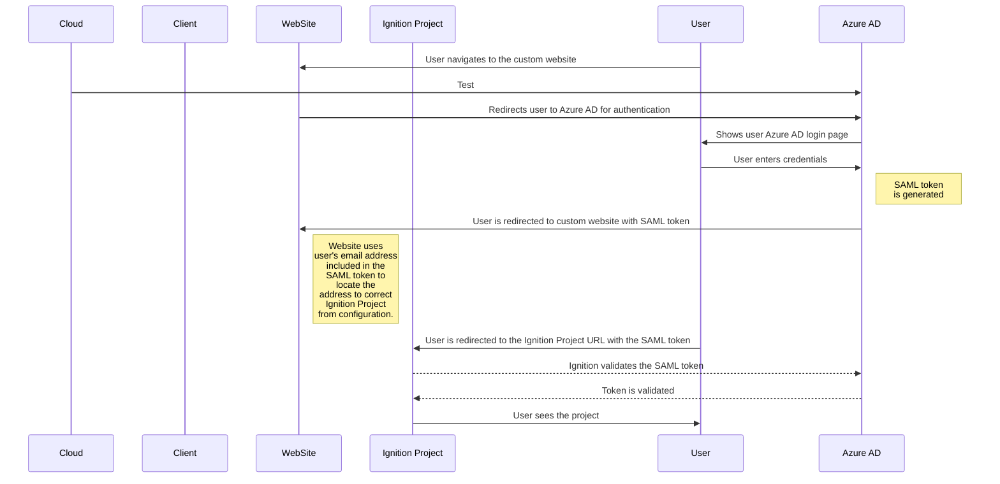

## Introduction

This is the placeholder for your documentation.

Testing diagrams:

```mermaid
sequenceDiagram
    participant Cloud
    participant Client
    participant WebSite
    participant Ignition Project
    User->>WebSite: User navigates to the custom website
    Cloud->>Azure AD: Test
	WebSite->>Azure AD: Redirects user to Azure AD for authentication
	Azure AD->>User: Shows user Azure AD login page
	User->>Azure AD: User enters credentials
	Note right of Azure AD: SAML token<br/>is generated
	Azure AD->>WebSite: User is redirected to custom website with SAML token
	Note right of WebSite: Website uses<br/>user's email address<br/>included in the<br/>SAML token to<br/>locate the<br/>address to correct<br/>Ignition Project<br/>from configuration.
	User->>Ignition Project:User is redirected to the Ignition Project URL with the SAML token
	Ignition Project-->>Azure AD:Ignition validates the SAML token
	Azure AD-->>Ignition Project:Token is validated
	Ignition Project->>User:User sees the project
```

## More information

Please see https://grazedocs.io for more information.